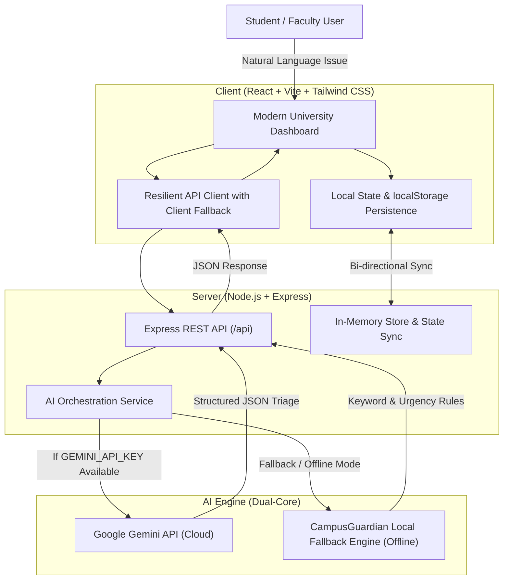

# 🛡️ CampusGuardian AI
> **"A Safer. Smarter. More Accessible Campus."**

[](#)
[](#)
[](#)
[](#)

---

## 📌 Project Overview
**CampusGuardian AI** is an intelligent campus safety, accessibility, and facility resolution platform engineered for university communities. Rather than forcing students to navigate complex municipal ticketing codes or bureaucratic departmental silos, CampusGuardian AI enables students and faculty to submit reports using natural, everyday language.

Our dual-intelligence architecture pairs **Google Gemini AI** with an offline **Local Fallback Rule & Triage Engine** to instantaneously:
1. Classify the problem into designated functional categories (**Safety, Maintenance, IT/Cybersecurity, Accessibility, Lost & Found, Facilities, Other**).
2. Assess situational urgency into priority ratings (**Critical, High, Medium, Low**).
3. Automatically route the incident to the appropriate campus department.
4. Synthesize a concise incident summary and prescribe recommended remedial actions.
5. Provide a transparent tracking lifecycle for students while equipping campus administrators with an operational dispatch hub.

---

## 🏗️ System Architecture



---

## ✨ Core Modules & Pages

### 1. 🌐 Landing Page
- Modern dark-navy visual aesthetic with glassmorphism cards and subtle ambient glows.
- Hero showcasing the core mission: *"A Safer. Smarter. More Accessible Campus."*
- Real-time campus telemetry statistics (Resolution Rate, Critical Active, Avg Triage Time).
- Interactive 4-step workflow (*Report → AI Triage → Department Dispatch → Lifecycle Tracking*).
- 1-click test prompt previews.

### 2. 📊 Student Dashboard
- Real-time incident counters: **Total Reports, Pending Actions, Critical Priority, Resolved**.
- Quick-action buttons to instantly report issues, chat with the AI assistant, or trigger emergency aid.
- Recent campus reports feed with live status badges.
- Campus Announcements & Safety Advisory bulletin board.

### 3. ✍️ AI-Powered Issue Reporter
- **Natural Language Input**: Type or paste any plain-language issue (e.g., *"The staircase light near Block C has been broken for three days and it is very dark at night."*).
- **Location Selector**: Custom location text input with one-click campus location pills.
- **Optional Photo Attachment**: Image upload simulation with preview thumbnail.
- **"Analyze with AI" Engine**:
  - Automatically predicts: **Category**, **Priority**, **Department**, **Summary**, **Recommended Action**, and **Confidence Score** (e.g., 94%).
  - **Editable before submission**: The student can adjust or override any prediction.
- **Submission Confirmation**: Generates a unique tracking ID (e.g. `CG-2026-8492`), persists data, and shows status as `Submitted`.

### 4. 🗂️ My Reports (Lifecycle Tracker)
- View all submitted campus incident reports.
- Comprehensive search by report ID, location, or keyword.
- Filter by:
  - **Status**: *Submitted, Under Review, Assigned, In Progress, Resolved*
  - **Priority**: *Critical, High, Medium, Low*
  - **Category**: *Safety, Maintenance, IT, Accessibility, Lost & Found, Facilities*
- Interactive modal with an audit timeline log showing timestamps and dispatch notes.

### 5. 🤖 AI Campus Assistant (GuardianBot)
- 24/7 interactive chat assistant powered by Gemini and our local campus knowledge base.
- Pre-configured prompt chips:
  - *"Where do I report a broken projector?"*
  - *"What should I do if I find a lost ID card?"*
  - *"How do I report a water leak?"*
  - *"Where can I find accessibility assistance?"*
  - *"What are the campus security numbers?"*
- Contextual interactive action buttons embedded directly into answers (e.g., *1-Click to prefill report*, *Open Accessibility Directory*, *Speed Dial Security*).

### 6. 🎛️ Administrator Triage Hub
- Administrative control center for campus operations and facilities management.
- Dynamic **Recharts** data visualizations:
  - **Category Distribution Chart** (Bar Chart)
  - **Priority Breakdown Chart** (Pie Chart with color-coded severity)
- Operational Incident Table:
  - Inline status update dropdown (`Submitted`, `Under Review`, `Assigned`, `In Progress`, `Resolved`).
  - Inline department reassignment dropdown.
  - One-click **"Mark Resolved"** action.
  - Export reports database to JSON.

### 7. 🚨 Emergency Center
- Clearly visible emergency section with **demo/configurable campus contact data** (distinctly disclaimed for safety).
- Direct call simulator for:
  - Campus Security Rapid Response (`Ext. 5555`)
  - University Medical Center & First Aid (`Ext. 5556`)
  - Campus Administration / Safety Marshall (`Ext. 5550`)
  - Mental Health & Crisis Helpline (`Ext. 5559`)
- **Instant SOS Distress Beacon**: Simulates critical incident logging and officer dispatch.
- Expandable step-by-step safety protocols (*Fire Evacuation, Severe Storm, Medical First Aid, Night SafeWalk Escort*).

### 8. ♿ Accessibility Center
- Dedicated hub supporting **Mobility**, **Visual**, **Hearing**, and **Neurodiversity** campus needs.
- **Accessible Facilities Directory**: Real-time status of ramps, elevators, hearing induction loops, and accessible shuttle routes.
- **Interactive Mobility Escort Request**: Form to schedule a student escort or electric golf cart across campus.
- Quick link to flag physical or digital accessibility barriers.

### 9. ⚙️ Settings & System Diagnostics
- Persona switcher between **Student** and **Administrator**.
- Notification preference toggles (Email, SMS Emergency, Push).
- Accessibility display settings: **High Contrast Mode**, **Typography Scaling** (Normal / Large / XL), and **Reduced Motion**.
- Real-time AI engine diagnostic monitor verifying connection to Gemini and local fallback status.
- **"Reset Demo Data"** button to restore sample campus reports.

---

## 🧠 AI Engine & Fallback Intelligence

The core AI engine lives in `server/services/aiService.js`.

```javascript
analyzeIssue(text, location)
```

1. **Gemini API Execution**:
   - When a valid `GEMINI_API_KEY` is present in `server/.env`, the backend queries Google's `gemini-2.0-flash` endpoint using structured JSON formatting.
2. **Autonomous Offline Fallback**:
   - If `GEMINI_API_KEY` is not provided, is invalid, or fails (rate-limit / offline), the engine **transparently switches to the built-in Local Fallback Engine**.
   - Analyzes semantic signals and keywords across 7 categories and 4 priority levels.
   - Computes confidence scores (85%–99%) and generates realistic dispatch summaries and recommended actions.
   - **Zero downtime guarantee**: The application will never break due to an external API outage.

---

## 💻 Tech Stack

| Layer | Technologies |
|---|---|
| **Frontend** | React 18, Vite, Tailwind CSS, Lucide React, Recharts |
| **Backend** | Node.js (v18+ / v20+ / v24+), Express 4, CORS, Dotenv |
| **AI Integration** | Google Gemini 2.0 REST API + Local Fallback Rule Engine |
| **Persistence** | LocalStorage (client) + In-Memory Store & Sync (Express server) |
| **Process Manager** | Concurrently (unified development script) |

---

## 🚀 Quick Start & Installation

### Prerequisites
- **Node.js**: v18.0.0 or higher
- **npm**: v8.0.0 or higher

### 1. Clone & Enter Directory
```bash
git clone https://github.com/vaibhavpatilvaibhu-alt/vaibhav-patil-24SUUBEAML673-.git
cd vaibhav-patil-24SUUBEAML673-
```

### 2. Install Dependencies
Run the install command to set up root, server, and client packages:
```bash
npm install
npm run install:all
```
*(On Windows PowerShell, use `npm.cmd install` and `npm.cmd run install:all`)*

### 3. Environment Configuration (Optional)
The application works **100% out of the box** using the built-in Local Fallback AI engine.
To connect live Google Gemini 2.0 AI:
1. Copy `server/.env.example` to `server/.env`:
   ```bash
   cp server/.env.example server/.env
   ```
2. Open `server/.env` and paste your Gemini API key:
   ```env
   PORT=5000
   GEMINI_API_KEY=your_actual_gemini_api_key_here
   NODE_ENV=development
   ```

### 4. Run the Application
Start both the Express backend (`http://localhost:5000`) and the Vite React frontend (`http://localhost:3000`) concurrently with a single command:
```bash
npm run dev
```

Open your browser at:
👉 **`http://localhost:3000`**

*(Note: You can also access the built production app directly at `http://localhost:5000`)*

---

## 🧪 Hackathon Evaluation Demo Workflow

Follow these steps to experience the complete end-to-end user journey:

1. **Landing Page (`http://localhost:3000`)**:
   - Review the headline: *"A Safer. Smarter. More Accessible Campus."*
   - Observe live telemetry counters and the 4-step workflow diagram.
   - Click the **"Report Campus Issue"** button.

2. **Report Issue Page**:
   - Click on the test scenario chip: **"Staircase Lighting"** (or type: *"The staircase light near Block C has been broken for three days and it is very dark at night."*).
   - Ensure location is set to: *"Block C - Staircase 2nd Floor"*.
   - Click the gradient button: **"Analyze with AI"**.
   - Watch the AI radar scan. The result card will appear displaying:
     - **Category**: `Safety`
     - **Priority**: `High`
     - **Department**: `Maintenance & Campus Safety`
     - **Summary**: `Broken lighting near Block C - Staircase 2nd Floor`
     - **Recommended Action**: `Inspect and replace staircase lighting fixture...`
     - **Confidence Score**: `94%`
   - Notice that every field can be edited by the user before submission.
   - Click **"Confirm & Submit Report"**.
   - A success receipt appears showing a unique Report ID (e.g. `CG-2026-8492`) with status `Submitted`.

3. **My Reports Page**:
   - Click **"Track Report in My Reports"**.
   - See your newly submitted report at the top of the list.
   - Test the filters: filter by Status (`Submitted`), Priority (`High`), or Category (`Safety`).
   - Click **"Inspect Timeline"** to view the audit log and detailed dispatch parameters.

4. **Admin Dashboard**:
   - In the navigation bar, switch the role pill to **Admin** (or click **"Admin Hub"** in the menu).
   - Observe the live analytics charts powered by Recharts (Category breakdown and Priority pie chart).
   - In the **Manage & Dispatch Incidents** table, locate your submitted report.
   - Change its status dropdown from `Submitted` to `In Progress` (or click **"Resolve"**).
   - Reassign the department dropdown if desired.

5. **AI Campus Assistant**:
   - Navigate to the **"AI Assistant"** tab.
   - Click the prompt chip: *"Where do I report a broken projector?"* (or ask your own campus question).
   - GuardianBot will immediately answer with relevant guidance and present interactive action buttons (e.g. *Report IT / AV Problem*).
   - Click the action button to verify smooth cross-page routing.

6. **Emergency Center & Accessibility Center**:
   - Click the pulsing red **"EMERGENCY SOS"** button in the navbar to test the emergency modal.
   - Navigate to the **Emergency Center** to explore campus speed-dials and safety instructions.
   - Navigate to the **Accessibility Center** to review step-free facility statuses and test the **Mobility Escort Request** dispatch.

---

## 🔒 Security & Privacy Practices
- **Server-Side API Key Storage**: Gemini API keys are only read on the Node.js Express server (`process.env.GEMINI_API_KEY`). They are **never** bundled or exposed to the client browser.
- `.env` is added to `.gitignore`.
- Fictional/demo campus data is strictly maintained with prominent user disclaimers for real-world emergency safety.

---

## 📁 Repository Structure

```
vaibhav-patil-24SUUBEAML673-/
├── client/                      # React 18 + Vite + Tailwind CSS Frontend
│   ├── public/
│   ├── src/
│   │   ├── components/          # Navbar, Footer, ToastContainer, EmergencyModal
│   │   ├── context/             # ReportsContext (global state, localStorage, sync)
│   │   ├── data/                # Initial realistic campus reports & announcements
│   │   ├── pages/               # 9 complete responsive pages
│   │   │   ├── LandingPage.jsx
│   │   │   ├── StudentDashboard.jsx
│   │   │   ├── ReportIssuePage.jsx
│   │   │   ├── MyReportsPage.jsx
│   │   │   ├── AIAssistantPage.jsx
│   │   │   ├── AdminDashboard.jsx
│   │   │   ├── EmergencyCenter.jsx
│   │   │   ├── AccessibilityCenter.jsx
│   │   │   └── SettingsPage.jsx
│   │   ├── services/            # Frontend API client with offline fallback
│   │   ├── App.jsx              # Main application router & layout
│   │   ├── index.css            # Tailwind directives, glassmorphism, contrast
│   │   └── main.jsx             # React entry point
│   ├── index.html
│   ├── package.json
│   ├── tailwind.config.js
│   └── vite.config.js
├── server/                      # Node.js + Express Backend
│   ├── routes/
│   │   └── api.js               # REST endpoints for analyze, chat, reports CRUD
│   │── services/
│   │   └── aiService.js         # Gemini 2.0 API + Local Fallback Rule Engine
│   ├── index.js                 # Express server & static hosting
│   ├── package.json
│   ├── .env.example
│   └── .env
├── .gitignore
├── .env.example
├── package.json                 # Unified orchestrator (concurrently)
└── README.md                    # Project documentation & demo guide
```

---

## 👥 Hackathon Team & Credits
- **Project**: CampusGuardian AI
- **Track**: Smart Campus Solutions
- **Author**: Vaibhav Patil (`24SUUBEAML673`)
- **Institution**: Aegis Institute of Technology (Demo Campus)
